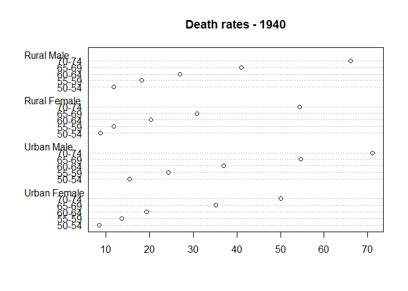

A R Script can be rendered!
================
XINGYU
2023-08-29

Sum the built-in dataset `VADeaths`

``` r
#  Here is a regular code comment, that remians as such
summary(VADeaths)
```

    ##    Rural Male     Rural Female     Urban Male     Urban Female  
    ##  Min.   :11.70   Min.   : 8.70   Min.   :15.40   Min.   : 8.40  
    ##  1st Qu.:18.10   1st Qu.:11.70   1st Qu.:24.30   1st Qu.:13.60  
    ##  Median :26.90   Median :20.30   Median :37.00   Median :19.30  
    ##  Mean   :32.74   Mean   :25.18   Mean   :40.48   Mean   :25.28  
    ##  3rd Qu.:41.00   3rd Qu.:30.90   3rd Qu.:54.60   3rd Qu.:35.10  
    ##  Max.   :66.00   Max.   :54.30   Max.   :71.10   Max.   :50.00

Can use markdown syntax **bold**

A example from `dotchat()` to make a Cleveland dot plot from `VADeaths`
Data And name this chuk so that the resulting PNG named.

``` r
dotchart(VADeaths, main = "Death rates - 1940")
```

<!-- -->
